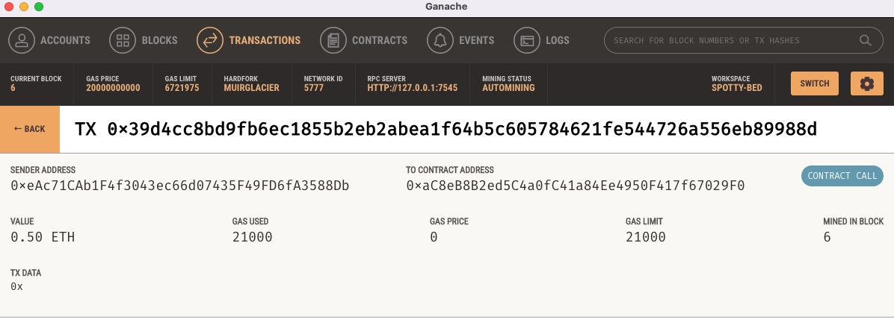

# hcm_recruiting
Hcm recruiting is a repository for a platform that will help user find fintech professionals they can hire or engage with. 


# Fintech finder Application: new application 

This is a tool that helps in firms or recruters in finding fintech professionals for possible engagements.
 

The current project is the inital design and development of the application to get MVP that can be tested on the current market cycle.

---

## Technologies


*[Jupyter](https://jupyter.org/documentation) - For documentation

*[Blockchain](https://web3py.readthedocs.io/en/stable/overview.html) For Ethereum based blockchain documentation

---

## Installation Guide

Before running the application first install the following dependencies.

```python
  pip install jupyterlab  
  pip install web3==5.17
  pip install eth-tester==0.5.0b3
  pip install mnemonic
  pip install bip44  
     
    
```
*[Install Ganache](https://www.trufflesuite.com/ganache) - Download and install the Latest Version of Ganache

---

## Usage

[fintech_finder.py](https://colab.research.google.com/github/odhissm/trading_bot/blob/main/bot_app/GC_machine_learning_trading_bot.ipynb) - to run the application from Google colab

with the:

```jupyter
from command line type

streamlit run fintech_finder.py
```

---

## Local Ganache Transaction output

a) address balance


b) block history


c) block history details


d) Ganache logs


e) transaction details



f) recipients address


---

## Contributors

Brought to you by odhissm@gmail.com

---

## License

MIT
